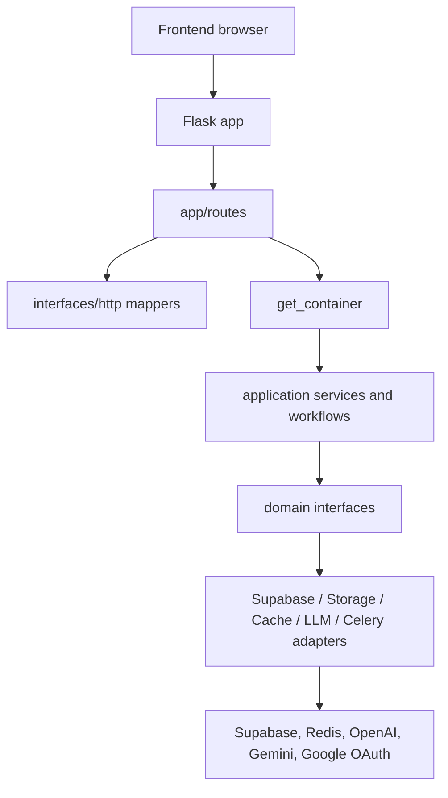
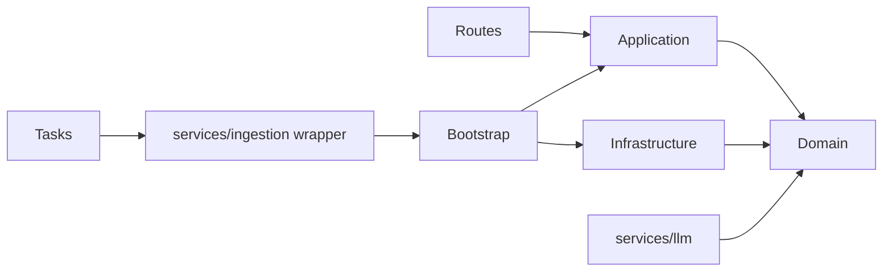
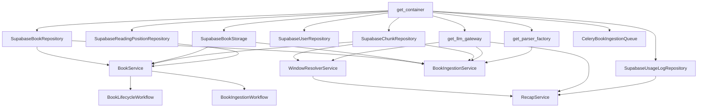
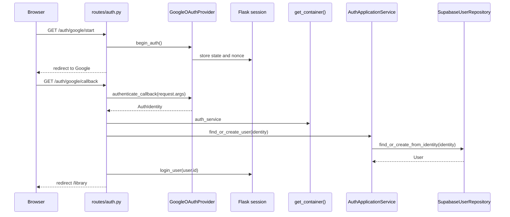
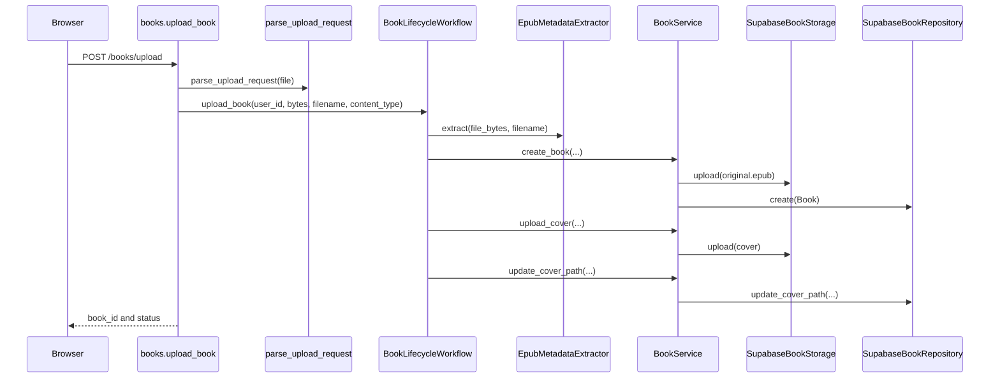
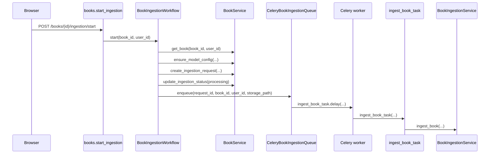
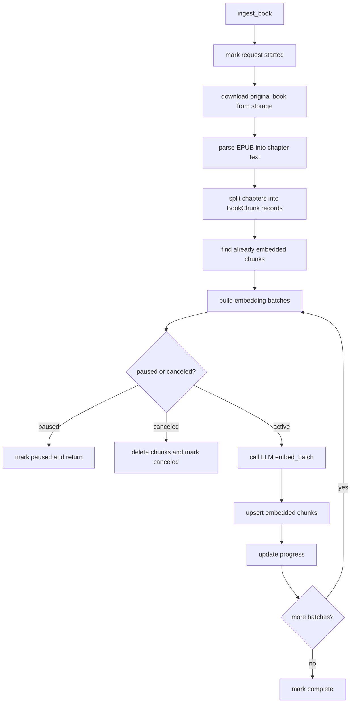
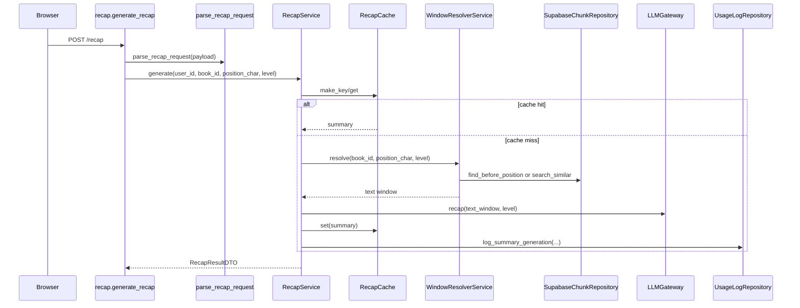

# Backend Design Overview

This document explains the current backend as it exists today.

The goal is not to defend the design. The goal is to make it readable.

## Short Version

The backend is a Flask app.

HTTP routes live in `backend/app/routes`.

Most newer business logic lives in `backend/app/application`.

Interfaces and dataclasses live in `backend/app/domain`.

Supabase, storage, parser, cache, Celery, and LLM implementations live mostly in `backend/app/infrastructure` and `backend/app/services`.

`backend/app/bootstrap/container.py` wires the concrete implementations into application services.

## Current Folder Meaning

| Folder | Current role | Reader warning |
|---|---|---|
| `app/routes` | Flask HTTP endpoints. | These call `get_container()` directly. |
| `app/interfaces/http` | Request parsing, response serialization, and error response helpers. | Only some routes use this consistently. |
| `app/application` | Use cases and app-level services. | This is where most newer business logic lives. |
| `app/domain` | Dataclasses and abstract interfaces. | These are mostly contracts, not rich domain objects. |
| `app/infrastructure` | Concrete adapters for Supabase, storage, cache, Celery, parsers, and LLM gateway factory. | Some real implementations still live in `app/services`. |
| `app/auth` | Session helpers, Google OAuth implementation, and compatibility wrappers. | This overlaps with `app/domain/auth` and `app/application/auth`. |
| `app/services` | Older service modules plus LLM provider implementations. | This folder is mixed: some files are legacy wrappers, some are real provider code. |
| `app/tasks` | Celery task entrypoints. | Calls back into the application container through a wrapper. |
| `app/utils` | Low-level helpers for EPUB/PDF parsing and token counting. | These are implementation utilities. |

## Configuration

Module: `backend/config.py`

`Config` is a class used as a global settings object.

It reads environment variables and a JSON limits file at import time.

Important attributes:

| Attribute group | Attributes |
|---|---|
| Server | `BACKEND_PORT`, `FRONTEND_URL` |
| Supabase | `SUPABASE_URL`, `SUPABASE_SERVICE_KEY` |
| Google OAuth | `GOOGLE_CLIENT_ID`, `GOOGLE_CLIENT_SECRET`, `GOOGLE_REDIRECT_URI` |
| Flask session | `FLASK_SECRET_KEY`, `SESSION_COOKIE_NAME`, `SESSION_COOKIE_SAMESITE`, `SESSION_COOKIE_SECURE` |
| Uploads | `MAX_UPLOAD_SIZE_MB` |
| Recaps | `RECAP_TOKEN_BUDGETS`, `RECAP_OUTPUT_INSTRUCTIONS` |
| Chunking | `CHUNK_SIZE_TOKENS`, `CHUNK_OVERLAP_TOKENS` |
| LLM selection | `LLM_PROVIDER`, `OPENAI_API_KEY`, `GEMINI_API_KEY`, `GEMINI_RECAP_MODEL`, `GEMINI_EMBEDDING_MODEL` |
| Celery/Redis | `REDIS_URL`, `CELERY_BROKER_URL`, `CELERY_RESULT_BACKEND`, `CELERY_WORKER_CONCURRENCY` |
| Ingestion logs | `INGESTION_LOG_DIR` |
| Gemini limits | `GEMINI_EMBEDDING_REQUESTS_PER_MINUTE`, `GEMINI_EMBEDDING_INPUT_TOKENS_PER_MINUTE`, `GEMINI_EMBEDDING_REQUESTS_PER_DAY`, `GEMINI_EMBEDDING_MAX_BATCH_CHUNKS`, `GEMINI_EMBEDDING_MAX_BATCH_INPUT_TOKENS`, `GEMINI_EMBEDDING_INTER_BATCH_JITTER_SECONDS`, retry settings |

Methods:

| Signature | Role |
|---|---|
| `validate() -> None` | Raises an error if required environment variables are missing. |

## Main Runtime Flow



## Dependency Direction



Important point: the intended design is "routes call application services, application services depend on domain interfaces, infrastructure implements those interfaces."

The current code mostly follows that, but there are exceptions:

- `app/routes/*` calls `get_container()` directly.
- `app/services/ingestion.py` and `app/services/window_resolver.py` are legacy wrappers that call `get_container()`.
- `app/auth` overlaps with `domain/auth` and `application/auth`.
- LLM provider implementations live in `app/services/llm`, not `app/infrastructure/llm`.

## Design Patterns In Use

| Pattern | Where | What it means here |
|---|---|---|
| Application service | `app/application/*/service.py` | A class that performs one feature area use case. |
| Workflow / orchestrator | `BookLifecycleWorkflow`, `BookIngestionWorkflow` | A class that coordinates multiple services or external steps. |
| Repository | `BookRepository`, `UserRepository`, `ReadingPositionRepository`, Supabase implementations | Abstract persistence contracts with Supabase adapters. |
| Adapter | Supabase repositories, `SupabaseBookStorage`, `InMemoryRecapCache`, LLM providers, `CeleryBookIngestionQueue` | Concrete code behind an interface. |
| Factory | `get_container`, `get_llm_gateway`, `get_provider`, `get_parser_factory` | Creates concrete objects based on config. |
| Service locator | `get_container()` calls from routes and legacy wrappers | Code asks a global container for dependencies. |
| DTO | `application/*/dto.py` and mapper request dataclasses | Simple dataclasses used to move data between layers. |
| Strategy | `LLMGateway`, `BaseLLMProvider`, `OpenAIProvider`, `GeminiProvider` | The active LLM provider changes by config. |
| Background job | Celery task and queue adapter | Ingestion runs outside the request process. |

## Container Wiring

`ApplicationContainer` is the object returned by `get_container()`.

It contains:

| Attribute | Type | Used for |
|---|---|---|
| `auth_service` | `AuthApplicationService` | User lookup and user creation after OAuth. |
| `book_service` | `BookService` | Book CRUD, storage URLs, ingestion request state. |
| `book_lifecycle_workflow` | `BookLifecycleWorkflow` | Upload and delete flows. |
| `ingestion_service` | `BookIngestionService` | The actual ingestion pipeline run by Celery. |
| `ingestion_workflow` | `BookIngestionWorkflow` | Start and resume ingestion jobs. |
| `position_service` | `ReadingPositionService` | Save and read current book position. |
| `recap_service` | `RecapService` | Generate cached recaps. |
| `system_service` | `SystemInfoService` | Report active LLM provider and models. |
| `window_resolver` | `WindowResolverService` | Pick book text used for recap generation. |



## HTTP Routes

### Auth Routes

Module: `backend/app/routes/auth.py`

| Function | Route | Role |
|---|---|---|
| `_frontend_url(path: str = "") -> str` | Helper | Builds a frontend redirect URL. |
| `start_google_auth()` | `GET /api/v1/auth/google/start` | Redirects the browser to Google OAuth. |
| `finish_google_auth()` | `GET /api/v1/auth/google/callback` | Completes Google OAuth, creates or updates a user, and logs them in. |
| `get_current_user()` | `GET /api/v1/auth/me` | Returns the session user or a 401 error. |
| `logout()` | `POST /api/v1/auth/logout` | Clears the session. |

### Book Routes

Module: `backend/app/routes/books.py`

| Function | Route | Role |
|---|---|---|
| `upload_book()` | `POST /api/v1/books/upload` | Parses an EPUB upload and calls `BookLifecycleWorkflow.upload_book`. |
| `get_book_status(book_id: str)` | `GET /api/v1/books/<book_id>/status` | Returns ingestion status and active LLM model info. |
| `start_ingestion(book_id: str)` | `POST /api/v1/books/<book_id>/ingestion/start` | Creates an ingestion request and enqueues a Celery job. |
| `list_ingestion_requests()` | `GET /api/v1/books/ingestion/requests` | Lists active ingestion requests for the current user. |
| `pause_ingestion(request_id: str)` | `POST /api/v1/books/ingestion/<request_id>/pause` | Marks an ingestion request as paused. |
| `resume_ingestion(request_id: str)` | `POST /api/v1/books/ingestion/<request_id>/resume` | Re-enqueues a paused or failed ingestion request. |
| `cancel_ingestion(request_id: str)` | `POST /api/v1/books/ingestion/<request_id>/cancel` | Cancels ingestion and removes chunks. |
| `list_books()` | `GET /api/v1/books/` | Lists user books with signed cover URLs. |
| `update_book_metadata(book_id: str)` | `PATCH /api/v1/books/<book_id>/metadata` | Updates book title and author. |
| `delete_book(book_id: str)` | `DELETE /api/v1/books/<book_id>` | Deletes book data, storage files, positions, chunks, and recap cache. |
| `get_book_file_url(book_id: str)` | `GET /api/v1/books/<book_id>/file-url` | Returns a signed storage URL for the original book file. |

### Position Routes

Module: `backend/app/routes/positions.py`

| Function | Route | Role |
|---|---|---|
| `upsert_position(book_id: str)` | `PUT /api/v1/positions/<book_id>` | Saves the current reading position. |
| `get_position(book_id: str)` | `GET /api/v1/positions/<book_id>` | Returns the saved reading position or an empty position. |

### Recap Routes

Module: `backend/app/routes/recap.py`

| Function | Route | Role |
|---|---|---|
| `generate_recap()` | `POST /api/v1/recap/` | Generates or returns a cached recap. |
| `get_levels()` | `GET /api/v1/recap/levels` | Returns available recap levels and token budgets. |

## Feature Flow Diagrams

### Login Flow



### Upload Book Flow



### Start Ingestion Flow



### Ingestion Pipeline



### Recap Flow



## Core Application Classes

### `AuthApplicationService`

Module: `backend/app/application/auth/service.py`

Attributes:

| Attribute | Type | Role |
|---|---|---|
| `_users` | `UserRepository` | Reads and writes user records. |

Methods:

| Signature | Role |
|---|---|
| `__init__(users: UserRepository) -> None` | Stores the user repository. |
| `get_user(user_id: str) -> UserDTO | None` | Looks up a user and returns a DTO. |
| `find_or_create_user(identity: AuthIdentity) -> UserDTO` | Creates or updates a user from OAuth identity. |
| `_to_dto(user: User) -> UserDTO` | Converts a domain `User` to `UserDTO`. |

### `BookService`

Module: `backend/app/application/books/service.py`

Attributes:

| Attribute | Type | Role |
|---|---|---|
| `_books` | `BookRepository` | Persists books and ingestion request state. |
| `_storage` | `BookStorage` | Stores and signs book/cover files. |
| `_chunks` | `ChunkRepository` | Deletes chunks during book cleanup or cancel. |
| `_positions` | `ReadingPositionRepository` | Deletes reading position during book cleanup. |

Methods:

| Signature | Role |
|---|---|
| `__init__(books, storage, chunks, positions) -> None` | Stores repositories and storage adapter. |
| `create_book(user_id, file_bytes, content_type, title, author) -> BookFileDTO` | Uploads original file and creates the book row. |
| `get_book(book_id, user_id) -> BookFileDTO | None` | Loads one user-owned book. |
| `list_books(user_id) -> list[BookFileDTO]` | Lists books for one user. |
| `update_metadata(book_id, user_id, title, author) -> BookFileDTO | None` | Updates title and author. |
| `update_cover_path(book_id, cover_path) -> None` | Stores the cover path on the book row. |
| `upload_cover(path, content, content_type) -> None` | Uploads a cover image to storage. |
| `update_ingestion_status(book_id, status, progress=None, step=None, error=None, request_id=None) -> None` | Updates ingestion status on the book row. |
| `create_ingestion_request(request: IngestionRequest) -> None` | Persists a new ingestion request. |
| `update_ingestion_request_task_id(request_id, task_id) -> None` | Saves the Celery task ID. |
| `mark_ingestion_request_finished(request_id, status, error_type=None, error_message=None) -> None` | Marks ingestion request complete, failed, or canceled. |
| `get_ingestion_request(request_id) -> IngestionRequest | None` | Loads one ingestion request. |
| `list_active_ingestion_requests(user_id) -> list[IngestionRequestDTO]` | Lists queued, processing, paused, and failed requests. |
| `pause_ingestion_request(request_id, user_id) -> IngestionRequestDTO | None` | Marks a request and book as paused. |
| `cancel_ingestion_request(request_id, user_id) -> IngestionRequestDTO | None` | Cancels the request, deletes chunks, and resets book status. |
| `ensure_model_config(provider, recap_model, embedding_model) -> str` | Returns or creates a model config row. |
| `create_signed_book_url(book_id, user_id, expires_in_seconds=3600) -> str | None` | Returns a signed URL for the original file. |
| `create_signed_cover_url(cover_path, expires_in_seconds=3600) -> str | None` | Returns a signed URL for the cover file. |
| `delete_book(book_id, user_id) -> BookFileDTO | None` | Removes storage files, chunks, position, and book row. |
| `get_book_status(book_id, user_id) -> BookStatusDTO | None` | Returns merged book and latest ingestion request status. |
| `to_book_dto(book, cover_url=None) -> BookDTO` | Converts internal book DTO to public list DTO. |
| `_to_file_dto(book: Book) -> BookFileDTO` | Converts domain `Book` to internal file DTO. |
| `_to_ingestion_request_dto(request) -> IngestionRequestDTO` | Converts domain ingestion request to API DTO. |

### `BookLifecycleWorkflow`

Module: `backend/app/application/books/lifecycle_workflow.py`

Attributes:

| Attribute | Type | Role |
|---|---|---|
| `_books` | `BookService` | Performs book and storage operations. |
| `_metadata_extractor` | `BookFileMetadataExtractor` | Extracts title, author, and cover from upload bytes. |
| `_recap_cache` | `RecapCache` | Invalidates recap cache on delete. |

Methods:

| Signature | Role |
|---|---|
| `__init__(books, metadata_extractor, recap_cache) -> None` | Stores collaborators. |
| `upload_book(user_id, file_bytes, filename, content_type) -> UploadBookResultDTO` | Extracts metadata, creates book, stores cover. |
| `delete_book(book_id, user_id) -> DeleteBookResultDTO | None` | Deletes book and invalidates recap cache. |
| `get_book(book_id, user_id) -> BookFileDTO | None` | Pass-through lookup used before delete. |
| `_store_cover(user_id, book_id, cover_bytes, content_type, extension) -> str | None` | Saves cover bytes and returns the storage path. |

### `BookIngestionWorkflow`

Module: `backend/app/application/books/ingestion_workflow.py`

Attributes:

| Attribute | Type | Role |
|---|---|---|
| `_books` | `BookService` | Reads book and updates ingestion request state. |
| `_queue` | `BookIngestionQueue` | Enqueues Celery ingestion tasks. |
| `_llm` | `LLMGateway` | Provides provider and model names for audit rows. |

Methods:

| Signature | Role |
|---|---|
| `__init__(books, queue, llm) -> None` | Stores collaborators. |
| `start(book_id, user_id) -> tuple[BookFileDTO | None, IngestionStartResultDTO]` | Creates request, updates status, and enqueues ingestion. |
| `resume(request_id, user_id) -> IngestionStartResultDTO | None` | Reactivates a request and enqueues ingestion again. |
| `_concise_error(exc: Exception) -> str` | Formats exception class and first message line. |

### `BookIngestionService`

Module: `backend/app/application/books/ingestion_service.py`

Attributes:

| Attribute | Type | Role |
|---|---|---|
| `_books` | `BookRepository` | Updates book and ingestion request state. |
| `_storage` | `BookStorage` | Downloads the original book file. |
| `_chunks` | `ChunkRepository` | Reads and writes book chunks. |
| `_llm` | `LLMGateway` | Creates embeddings. |
| `_parsers` | `ParserFactory` | Chooses a parser for the downloaded file. |

Methods:

| Signature | Role |
|---|---|
| `__init__(books, storage, chunks, llm, parsers) -> None` | Stores collaborators. |
| `ingest_book(book_id, user_id, storage_path, request_id=None) -> None` | Runs the full ingestion pipeline. |
| `_download_file(storage_path: str) -> str` | Downloads storage bytes into a temp EPUB file. |
| `_chunk_text(book_id: str, chapters: list[dict]) -> list[BookChunk]` | Splits parsed chapters into overlapping chunks. |
| `_embed_chunks(request_id, book_id, chunks) -> list[BookChunk]` | Embeds missing chunks in batches and saves progress. |
| `_embedding_batches(chunks) -> list[list[BookChunk]]` | Groups chunks according to provider limits. |
| `_sleep_for_embedding_rate_limit(input_tokens, request_units=1) -> None` | Sleeps between Gemini batches. |
| `_update_embedding_progress(request_id, embedded_chunks, total_chunks, embedded_tokens, total_tokens) -> None` | Writes chunk/token progress to the request row. |
| `_get_control_status(request_id) -> str` | Reads active, paused, or canceled status. |
| `_is_control_status(request_id, status) -> bool` | Checks if the request has a specific control status. |
| `_update_ingestion(book_id, request_id, status, step=None, progress=None, error=None) -> None` | Updates both book and request ingestion state. |
| `_ingestion(status, step=None, progress=None, error=None, request_id=None)` | Builds an `IngestionInfo` object. |
| `_concise_error(exc: Exception) -> str` | Formats exception class and first message line. |

### `ReadingPositionService`

Module: `backend/app/application/positions/service.py`

Attributes:

| Attribute | Type | Role |
|---|---|---|
| `_positions` | `ReadingPositionRepository` | Persists reading positions. |

Methods:

| Signature | Role |
|---|---|
| `__init__(positions: ReadingPositionRepository) -> None` | Stores the repository. |
| `save(user_id, book_id, position_cfi, position_char) -> None` | Creates and saves a `ReadingPosition`. |
| `get(user_id, book_id) -> ReadingPositionDTO | None` | Loads and converts the saved position. |

### `WindowResolverService`

Module: `backend/app/application/recap/service.py`

Attributes:

| Attribute | Type | Role |
|---|---|---|
| `_chunks` | `ChunkRepository` | Reads chunks before a reading position. |
| `_llm` | `LLMGateway` | Embeds the semantic query for high recap levels. |

Methods:

| Signature | Role |
|---|---|
| `__init__(chunks: ChunkRepository, llm: LLMGateway) -> None` | Stores collaborators. |
| `resolve(book_id, position_char, level) -> str` | Selects source text for a recap. |
| `_greedy_select(rows, token_budget) -> list[BookChunk]` | Picks chunks until the token budget is full. |

### `RecapService`

Module: `backend/app/application/recap/service.py`

Attributes:

| Attribute | Type | Role |
|---|---|---|
| `_window_resolver` | `WindowResolverService` | Provides recap source text. |
| `_cache` | `RecapCache` | Caches recap text. |
| `_llm` | `LLMGateway` | Generates recap text. |
| `_usage_logs` | `UsageLogRepository` | Logs token usage and estimated cost. |

Methods:

| Signature | Role |
|---|---|
| `__init__(window_resolver, cache, llm, usage_logs) -> None` | Stores collaborators. |
| `generate(user_id, book_id, position_char, level) -> RecapResultDTO` | Returns cached recap or generates a new one. |
| `_estimated_cost_usd(input_tokens, output_tokens, model) -> float` | Estimates cost for known models. |

### `SystemInfoService`

Module: `backend/app/application/system/service.py`

Attributes:

| Attribute | Type | Role |
|---|---|---|
| `_llm` | `LLMGateway` | Source of provider/model names. |

Methods:

| Signature | Role |
|---|---|
| `__init__(llm: LLMGateway) -> None` | Stores the LLM gateway. |
| `get_llm_provider_info() -> LLMProviderInfoDTO` | Returns provider, recap model, and embedding model. |

## Domain Dataclasses

These classes mostly hold data. They do not contain business behavior.

### Auth

Module: `backend/app/domain/auth/models.py`

| Class | Attributes |
|---|---|
| `AuthIdentity` | `provider`, `provider_subject`, `email`, `display_name`, `avatar_url`, `email_verified` |
| `User` | `id`, `email`, `display_name`, `avatar_url`, `auth_provider` |

### Books

Module: `backend/app/domain/books/models.py`

| Class | Attributes |
|---|---|
| `BookMetadata` | `title`, `author` |
| `IngestionInfo` | `status`, `progress`, `step`, `error`, `request_id` |
| `IngestionRequest` | `id`, `book_id`, `user_id`, `book_title`, `model_config_id`, `status`, `progress`, `step`, `error_type`, `error_message`, `log_path`, `celery_task_id`, `control_status`, `embedded_chunks`, `total_chunks`, `embedded_tokens`, `total_tokens`, `created_at`, `started_at`, `completed_at` |
| `Book` | `id`, `user_id`, `storage_path`, `metadata`, `ingestion`, `cover_path`, `created_at` |
| `BookChunk` | `book_id`, `chapter_index`, `chunk_index`, `start_char`, `end_char`, `token_count`, `text`, `embedding` |

### Positions

Module: `backend/app/domain/positions/models.py`

| Class | Attributes |
|---|---|
| `ReadingPosition` | `user_id`, `book_id`, `position_cfi`, `position_char`, `updated_at` |

## Application DTOs

DTO means "data transfer object." These are dataclasses returned by application services.

| Class | Module | Attributes |
|---|---|---|
| `UserDTO` | `application/auth/dto.py` | `id`, `email`, `display_name`, `avatar_url`, `auth_provider` |
| `BookDTO` | `application/books/dto.py` | `id`, `title`, `author`, `cover_path`, `cover_url`, `ingestion_status`, `ingestion_progress`, `ingestion_step`, `ingestion_error`, `created_at` |
| `BookFileDTO` | `application/books/dto.py` | `id`, `user_id`, `storage_path`, `title`, `author`, `cover_path`, `ingestion_status`, `ingestion_progress`, `ingestion_step`, `ingestion_error`, `created_at` |
| `BookStatusDTO` | `application/books/dto.py` | `id`, `status`, `progress`, `step`, `error`, `error_type`, `request_id`, `log_path`, `model_config_id` |
| `IngestionRequestDTO` | `application/books/dto.py` | `id`, `book_id`, `book_title`, `status`, `control_status`, `progress`, `step`, `error_type`, `error_message`, `embedded_chunks`, `total_chunks`, `embedded_tokens`, `total_tokens`, `created_at`, `started_at`, `completed_at` |
| `UploadBookResultDTO` | `application/books/lifecycle_workflow.py` | `book_id`, `status` |
| `DeleteBookResultDTO` | `application/books/lifecycle_workflow.py` | `book_id`, `deleted` |
| `IngestionStartResultDTO` | `application/books/ingestion_workflow.py` | `book_id`, `request_id`, `status`, `task_id` |
| `ReadingPositionDTO` | `application/positions/dto.py` | `book_id`, `user_id`, `position_cfi`, `position_char`, `updated_at` |
| `RecapResultDTO` | `application/recap/dto.py` | `summary`, `level`, `cached` |
| `LLMProviderInfoDTO` | `application/system/dto.py` | `provider`, `recap_model`, `embedding_model` |

## Domain Interfaces

### Auth Interfaces

| Interface | Method signature | Role |
|---|---|---|
| `UserRepository` | `get_by_id(user_id: str) -> User | None` | Load a user by app user ID. |
| `UserRepository` | `find_or_create_from_identity(identity: AuthIdentity) -> User` | Find or create a user from OAuth identity. |
| `OAuthProvider` | `begin_auth() -> str` | Start OAuth and return provider URL. |
| `OAuthProvider` | `authenticate_callback(request_args) -> AuthIdentity` | Validate callback and return identity. |

### Book Interfaces

| Interface | Method signature | Role |
|---|---|---|
| `BookRepository` | `create(book: Book) -> None` | Insert a book row. |
| `BookRepository` | `get_by_id(book_id: str, user_id: str) -> Book | None` | Load a user-owned book. |
| `BookRepository` | `list_by_user(user_id: str) -> list[Book]` | List books for one user. |
| `BookRepository` | `update_metadata(book_id, user_id, metadata) -> Book | None` | Update title and author. |
| `BookRepository` | `update_cover_path(book_id, cover_path) -> None` | Save cover storage path. |
| `BookRepository` | `update_ingestion(book_id, ingestion) -> None` | Save ingestion status on the book. |
| `BookRepository` | `create_ingestion_request(request) -> None` | Insert an ingestion request row. |
| `BookRepository` | `update_ingestion_request(request_id, ingestion) -> None` | Update request status, step, progress, or error. |
| `BookRepository` | `mark_ingestion_request_started(request_id) -> None` | Mark request as processing. |
| `BookRepository` | `mark_ingestion_request_finished(request_id, status, error_type=None, error_message=None) -> None` | Mark request complete, failed, or canceled. |
| `BookRepository` | `update_ingestion_request_task_id(request_id, task_id) -> None` | Save Celery task ID. |
| `BookRepository` | `get_latest_ingestion_request(book_id, user_id) -> IngestionRequest | None` | Load latest request for a book. |
| `BookRepository` | `get_ingestion_request(request_id) -> IngestionRequest | None` | Load one request. |
| `BookRepository` | `list_ingestion_requests_by_user(user_id, statuses=None) -> list[IngestionRequest]` | List user requests, optionally filtered by status. |
| `BookRepository` | `update_ingestion_request_progress(request_id, embedded_chunks, total_chunks, embedded_tokens, total_tokens) -> None` | Save embedding counters. |
| `BookRepository` | `update_ingestion_request_control(request_id, control_status, status=None) -> None` | Save pause/cancel/active control state. |
| `BookRepository` | `ensure_model_config(provider, recap_model, embedding_model) -> str` | Return or create a model config ID. |
| `BookRepository` | `delete(book_id, user_id) -> None` | Delete a book row. |
| `ChunkRepository` | `delete_by_book(book_id) -> None` | Delete all chunks for a book. |
| `ChunkRepository` | `replace_for_book(book_id, chunks) -> None` | Replace all chunks for a book. |
| `ChunkRepository` | `upsert_for_book(book_id, chunks) -> None` | Insert or update chunks by book/chapter/chunk key. |
| `ChunkRepository` | `find_embedded_keys(book_id) -> set[tuple[int, int]]` | Return chunk keys that already have embeddings. |
| `ChunkRepository` | `find_before_position(book_id, position_char) -> list[BookChunk]` | Return chunks before the current reading position. |
| `ChunkRepository` | `search_similar(book_id, query_embedding, max_char_offset, token_budget) -> list[BookChunk]` | Return semantically similar chunks before a position. |
| `BookStorage` | `upload(path, content, content_type) -> None` | Store bytes. |
| `BookStorage` | `download(path) -> bytes` | Read bytes. |
| `BookStorage` | `remove_many(paths) -> None` | Delete stored files. |
| `BookStorage` | `create_signed_url(path, expires_in_seconds) -> str | None` | Create temporary access URL. |
| `BookIngestionQueue` | `enqueue(request_id, book_id, user_id, storage_path) -> str | None` | Enqueue a background ingestion task. |
| `BookParser` | `extract() -> list[dict]` | Extract chapters from a local file. |
| `ParserFactory` | `get_parser(filepath: str) -> BookParser` | Choose parser by file path. |
| `BookFileMetadataExtractor` | `extract(file_bytes, filename=None) -> ExtractedBookMetadata` | Extract title, author, and cover from upload bytes. |

### Position Interfaces

| Interface | Method signature | Role |
|---|---|---|
| `ReadingPositionRepository` | `save(position: ReadingPosition) -> None` | Insert or update current reading position. |
| `ReadingPositionRepository` | `get(user_id, book_id) -> ReadingPosition | None` | Load saved reading position. |
| `ReadingPositionRepository` | `delete(user_id, book_id) -> None` | Delete saved reading position. |

### Recap Interfaces

| Interface | Method signature | Role |
|---|---|---|
| `RecapCache` | `get(cache_key: str) -> str | None` | Read cached recap. |
| `RecapCache` | `set(cache_key, summary, ttl_seconds=86400) -> None` | Write cached recap. |
| `RecapCache` | `make_key(book_id, position_char, level) -> str` | Create cache key. |
| `RecapCache` | `invalidate_book(book_id) -> None` | Remove cached recaps for a book. |
| `LLMGateway` | `recap(text_window, level) -> str` | Generate recap text. |
| `LLMGateway` | `embed(text) -> list[float]` | Create one embedding. |
| `LLMGateway` | `embed_batch(texts) -> list[list[float]]` | Create many embeddings. |
| `UsageLogRepository` | `log_summary_generation(...) -> None` | Store recap token usage. |

## Infrastructure Implementations

### Supabase Repositories

| Class | Implements | Role |
|---|---|---|
| `SupabaseUserRepository` | `UserRepository` | Uses `app_users` table. |
| `SupabaseBookRepository` | `BookRepository` | Uses `books`, `ingestion_requests`, `ingestion_request_events`, and `ai_model_configs`. |
| `SupabaseChunkRepository` | `ChunkRepository` | Uses `book_chunks` table and `match_chunks` RPC. |
| `SupabaseReadingPositionRepository` | `ReadingPositionRepository` | Uses `reading_positions` table. |
| `SupabaseUsageLogRepository` | `UsageLogRepository` | Uses `llm_usage` table. |

Common attribute:

| Attribute | Type | Role |
|---|---|---|
| `_client_factory` | `Callable[[], Client]` | Creates a Supabase client on demand. |

`SupabaseBookRepository` method behavior:

| Method | Role |
|---|---|
| `create(book)` | Inserts into `books`. |
| `get_by_id(book_id, user_id)` | Selects one user-owned book. |
| `list_by_user(user_id)` | Selects all books for a user ordered by creation time. |
| `update_metadata(book_id, user_id, metadata)` | Updates title and author. |
| `update_cover_path(book_id, cover_path)` | Updates `cover_path`; silently skips if schema does not support it. |
| `update_ingestion(book_id, ingestion)` | Updates book-level ingestion columns. |
| `create_ingestion_request(request)` | Inserts an ingestion request and creates an event. |
| `update_ingestion_request(request_id, ingestion)` | Updates request status/progress/error and creates an event. |
| `mark_ingestion_request_started(request_id)` | Marks a request as processing and creates an event. |
| `mark_ingestion_request_finished(request_id, status, error_type=None, error_message=None)` | Marks a request terminal and creates an event. |
| `update_ingestion_request_task_id(request_id, task_id)` | Saves Celery task ID. |
| `get_latest_ingestion_request(book_id, user_id)` | Loads latest request for a book/user. |
| `get_ingestion_request(request_id)` | Loads one request by ID. |
| `list_ingestion_requests_by_user(user_id, statuses=None)` | Lists requests for a user, optionally filtered. |
| `update_ingestion_request_progress(request_id, embedded_chunks, total_chunks, embedded_tokens, total_tokens)` | Saves embedding counters. |
| `update_ingestion_request_control(request_id, control_status, status=None)` | Saves pause/cancel/active state and creates an event. |
| `ensure_model_config(provider, recap_model, embedding_model)` | Upserts or finds an AI model config row. |
| `_create_ingestion_event(request_id, status, progress=None, step=None, message=None)` | Inserts into `ingestion_request_events`. |
| `delete(book_id, user_id)` | Deletes one book row. |
| `_client()` | Returns a Supabase client. |
| `_select_books()` | Builds a select query with schema fallback. |
| `_map_ingestion_request(row)` | Converts a DB row to `IngestionRequest`. |

`SupabaseChunkRepository` method behavior:

| Method | Role |
|---|---|
| `delete_by_book(book_id)` | Deletes chunks for one book. |
| `replace_for_book(book_id, chunks)` | Deletes existing chunks and inserts new chunks. |
| `upsert_for_book(book_id, chunks)` | Upserts chunk rows by book/chapter/chunk key. |
| `find_embedded_keys(book_id)` | Returns chunk keys already present in the database. |
| `find_before_position(book_id, position_char)` | Loads chunks ending before the reader position. |
| `search_similar(book_id, query_embedding, max_char_offset, token_budget)` | Calls `match_chunks` RPC and filters by max offset. |
| `_map_chunk(row)` | Converts a DB row to `BookChunk`. |

Other Supabase repository method behavior:

| Class | Method | Role |
|---|---|---|
| `SupabaseUserRepository` | `get_by_id(user_id)` | Loads one user from `app_users`. |
| `SupabaseUserRepository` | `find_or_create_from_identity(identity)` | Updates existing OAuth user or inserts a new one. |
| `SupabaseReadingPositionRepository` | `save(position)` | Upserts, updates, or inserts a reading position. |
| `SupabaseReadingPositionRepository` | `get(user_id, book_id)` | Loads one reading position. |
| `SupabaseReadingPositionRepository` | `delete(user_id, book_id)` | Deletes one reading position. |
| `SupabaseUsageLogRepository` | `log_summary_generation(...)` | Inserts one LLM usage row. |

### Storage

Class: `SupabaseBookStorage`

Implements: `BookStorage`

Attribute:

| Attribute | Type | Role |
|---|---|---|
| `_client_factory` | `Callable[[], Client]` | Creates a Supabase client on demand. |

Methods:

| Signature | Role |
|---|---|
| `upload(path, content, content_type) -> None` | Uploads bytes to the `books` storage bucket. |
| `download(path) -> bytes` | Downloads bytes from the `books` bucket. |
| `remove_many(paths) -> None` | Deletes files from the `books` bucket. |
| `create_signed_url(path, expires_in_seconds) -> str | None` | Creates a temporary signed URL. |

### Cache

Class: `InMemoryRecapCache`

Implements: `RecapCache`

Methods:

| Signature | Role |
|---|---|
| `get(cache_key) -> str | None` | Reads from module-level memory cache. |
| `set(cache_key, summary, ttl_seconds=86400) -> None` | Writes to module-level memory cache. |
| `make_key(book_id, position_char, level) -> str` | Creates a hash key and records it under the book ID. |
| `invalidate_book(book_id) -> None` | Deletes all known cache entries for a book. |

### Queue

Class: `CeleryBookIngestionQueue`

Implements: `BookIngestionQueue`

Methods:

| Signature | Role |
|---|---|
| `enqueue(request_id, book_id, user_id, storage_path) -> str | None` | Calls `ingest_book_task.delay(...)` and returns Celery task ID. |

### Parsers

| Class | Implements | Attributes | Methods |
|---|---|---|---|
| `DefaultParserFactory` | `ParserFactory` | None | `get_parser(filepath)`: returns `EpubParser` for `.epub`, `PdfParser` for `.pdf`, otherwise raises validation error. |
| `EpubMetadataExtractor` | `BookFileMetadataExtractor` | None | `extract(file_bytes, filename=None)`: returns normalized `ExtractedBookMetadata`. |
| `EpubParser` | `BookParser` by shape | `filepath` | `extract()`: reads EPUB spine items and returns chapter dictionaries. |
| `PdfParser` | `BookParser` by shape | `filepath` | `extract()`: currently raises `NotImplementedError`. |

### LLM Providers

| Class | Implements | Attributes/properties | Methods |
|---|---|---|---|
| `BaseLLMProvider` | `LLMGateway` | `provider_name`, `recap_model`, `embedding_model` | Abstract `recap`, `embed`, `embed_batch`. |
| `OpenAIProvider` | `BaseLLMProvider` | `provider_name="openai"`, `recap_model="gpt-4o-mini"`, `embedding_model="text-embedding-3-small"`, `client` | `recap`: chat completion; `embed`: one embedding; `embed_batch`: batch embeddings. |
| `GeminiProvider` | `BaseLLMProvider` | `provider_name="gemini"`, `base_url`, `recap_model` property, `embedding_model` property | `recap`: Gemini generateContent; `embed`: one embedding; `embed_batch`: batch embeddings; private helpers build URLs, headers, retries, and parse vectors. |
| `ClaudeProvider` | `BaseLLMProvider` | `provider_name="claude"`, `recap_model` | All main methods raise `NotImplementedError`. |

Factories:

| Function | Role |
|---|---|
| `get_provider(name: str | None = None) -> BaseLLMProvider` | Returns OpenAI, Gemini, or Claude provider based on config/name. |
| `get_llm_gateway(name: str | None = None) -> LLMGateway` | Infrastructure alias around `get_provider`. |

## Auth Package Details

`app/auth` is mixed. It contains current session logic, Google OAuth code, and compatibility exports.

| Class/function | Module | Role |
|---|---|---|
| `GoogleOAuthProvider` | `app/auth/providers/google.py` | Starts and completes Google OAuth. |
| `begin_auth() -> str` | `GoogleOAuthProvider` | Stores state/nonce and builds Google auth URL. |
| `authenticate_callback(request_args) -> AuthIdentity` | `GoogleOAuthProvider` | Validates state/code/token/nonce and returns identity. |
| `_exchange_code_for_tokens(code) -> dict` | `GoogleOAuthProvider` | Calls Google token endpoint. |
| `_verify_google_identity(id_token) -> dict` | `GoogleOAuthProvider` | Verifies Google ID token and nonce. |
| `current_user_id() -> str | None` | `app/auth/session.py` | Reads user ID from Flask session. |
| `login_user(user_id) -> None` | `app/auth/session.py` | Clears session and stores user ID. |
| `logout_user() -> None` | `app/auth/session.py` | Clears session. |
| `require_auth(view_func)` | `app/auth/session.py` | Decorator that returns 401 if no user is logged in. |
| `AuthService` | `app/auth/service.py` | Legacy wrapper around `get_container().auth_service`. |

## Request Mapper Classes

These dataclasses represent parsed HTTP input.

| Class | Module | Attributes |
|---|---|---|
| `UploadBookRequest` | `interfaces/http/mappers/books.py` | `file_bytes`, `filename`, `content_type` |
| `UpdateBookMetadataRequest` | `interfaces/http/mappers/books.py` | `title`, `author` |
| `PositionRequest` | `interfaces/http/mappers/positions.py` | `position_cfi`, `position_char` |
| `RecapRequest` | `interfaces/http/mappers/recap.py` | `book_id`, `position_char`, `level` |

Mapper functions:

| Function | Role |
|---|---|
| `parse_upload_request(file) -> UploadBookRequest` | Validates EPUB upload and size limit. |
| `parse_book_metadata_update(payload) -> UpdateBookMetadataRequest` | Normalizes title and author. |
| `parse_position_payload(payload) -> PositionRequest` | Validates position CFI and integer char offset. |
| `serialize_position(position) -> dict` | Converts missing/current position to response dict. |
| `parse_recap_request(payload) -> RecapRequest` | Validates recap request fields and level range. |
| `serialize_recap_levels() -> list[dict]` | Returns level metadata from config. |
| `error_response(error: ApplicationError)` | Converts app error to JSON and status code. |

## Celery Task

Module: `backend/app/tasks/ingestion_tasks.py`

| Function | Role |
|---|---|
| `ingest_book_task(request_id, book_id, user_id, storage_path) -> None` | Celery task that sets up task logging and runs ingestion. |
| `_task_log_context(log_path: Path) -> Iterator[None]` | Redirects logs/stdout/stderr to the ingestion log file. |

The task calls `app.services.ingestion.ingest_book`, which then calls `get_container().ingestion_service.ingest_book(...)`.

## Utility Functions

| Function | Module | Role |
|---|---|---|
| `create_app() -> Flask` | `app/__init__.py` | Validates config, creates Flask app, configures session/CORS, registers routes. |
| `create_supabase_client() -> Client` | `infrastructure/db/supabase/client.py` | Creates a Supabase client. |
| `extract_epub_metadata(file_bytes, filename=None) -> dict[str, object]` | `utils/epub_metadata.py` | Extracts title, author, and cover from EPUB bytes. |
| `_first_metadata_value(entries) -> str | None` | `utils/epub_metadata.py` | Returns first non-empty metadata value. |
| `_extract_cover(book) -> dict[str, object] | None` | `utils/epub_metadata.py` | Finds a cover image in an EPUB. |
| `_cover_payload(image_bytes, content_type, name) -> dict[str, object] | None` | `utils/epub_metadata.py` | Builds cover byte/content-type/extension payload. |
| `count(text, model="gpt-4o-mini") -> int` | `utils/token_counter.py` | Counts tokens with cached `tiktoken` encoders. |
| `get_parser(filepath: str)` | `utils/parser_factory.py` | Legacy parser factory helper. |
| `ingest_book(...) -> None` | `services/ingestion.py` | Legacy wrapper around container ingestion service. |
| `resolve(...) -> str` | `services/window_resolver.py` | Legacy wrapper around container window resolver. |

## Error Classes

Module: `backend/app/application/errors.py`

| Class | Status | Role |
|---|---:|---|
| `ApplicationError` | `400` default | Base app exception with message and status code. |
| `ValidationError` | `400` | Bad client input. |
| `AuthenticationError` | `401` | Missing or invalid session. |
| `NotFoundError` | `404` | Missing entity. |
| `ConflictError` | `409` | Conflicting request state. |
| `InfrastructureError` | `500` | External system or persistence failure. |

## Current Naming Confusion

The auth area is the clearest example.

| Name | Actual current meaning |
|---|---|
| `app/auth` | Session helpers, Google OAuth implementation, and compatibility exports. |
| `app/domain/auth` | Auth dataclasses and repository/provider interfaces. |
| `app/application/auth` | User use case service and `UserDTO`. |
| `app/routes/auth.py` | Auth HTTP endpoints. |

The book area has similar overlap.

| Name | Actual current meaning |
|---|---|
| `BookService` | General book CRUD, storage URL, and ingestion state helper. |
| `BookLifecycleWorkflow` | Upload/delete orchestration. |
| `BookIngestionWorkflow` | Start/resume ingestion request orchestration. |
| `BookIngestionService` | Actual ingestion runner. |
| `app/services/ingestion.py` | Legacy wrapper for Celery to call the runner. |

## Mental Model For Reading The Code

Use this order when reading a feature:

1. Start in `app/routes`.
2. Find which container service the route calls.
3. Open that class in `app/application`.
4. Check which domain interfaces it depends on.
5. Open `app/bootstrap/container.py` to see which concrete implementation is injected.
6. Open the concrete implementation in `app/infrastructure` or `app/services`.

For example, for recap generation:

```text
routes/recap.py
-> get_container().recap_service
-> application/recap/service.py::RecapService
-> WindowResolverService + RecapCache + LLMGateway + UsageLogRepository
-> container.py
-> SupabaseChunkRepository + InMemoryRecapCache + OpenAIProvider/GeminiProvider + SupabaseUsageLogRepository
```

For ingestion:

```text
routes/books.py::start_ingestion
-> BookIngestionWorkflow.start
-> BookService creates request and updates book state
-> CeleryBookIngestionQueue.enqueue
-> tasks/ingestion_tasks.py::ingest_book_task
-> services/ingestion.py wrapper
-> BookIngestionService.ingest_book
-> storage download, parser, chunker, LLM embeddings, Supabase chunks
```

## What This Backend Is Trying To Be

It is trying to be a layered backend:

```text
HTTP routes
-> application use cases
-> domain interfaces/dataclasses
-> infrastructure adapters
-> external systems
```

That idea is present, but the naming and folder split are not always clear.

The safest way to understand the code is to follow real call paths, not folder names alone.
